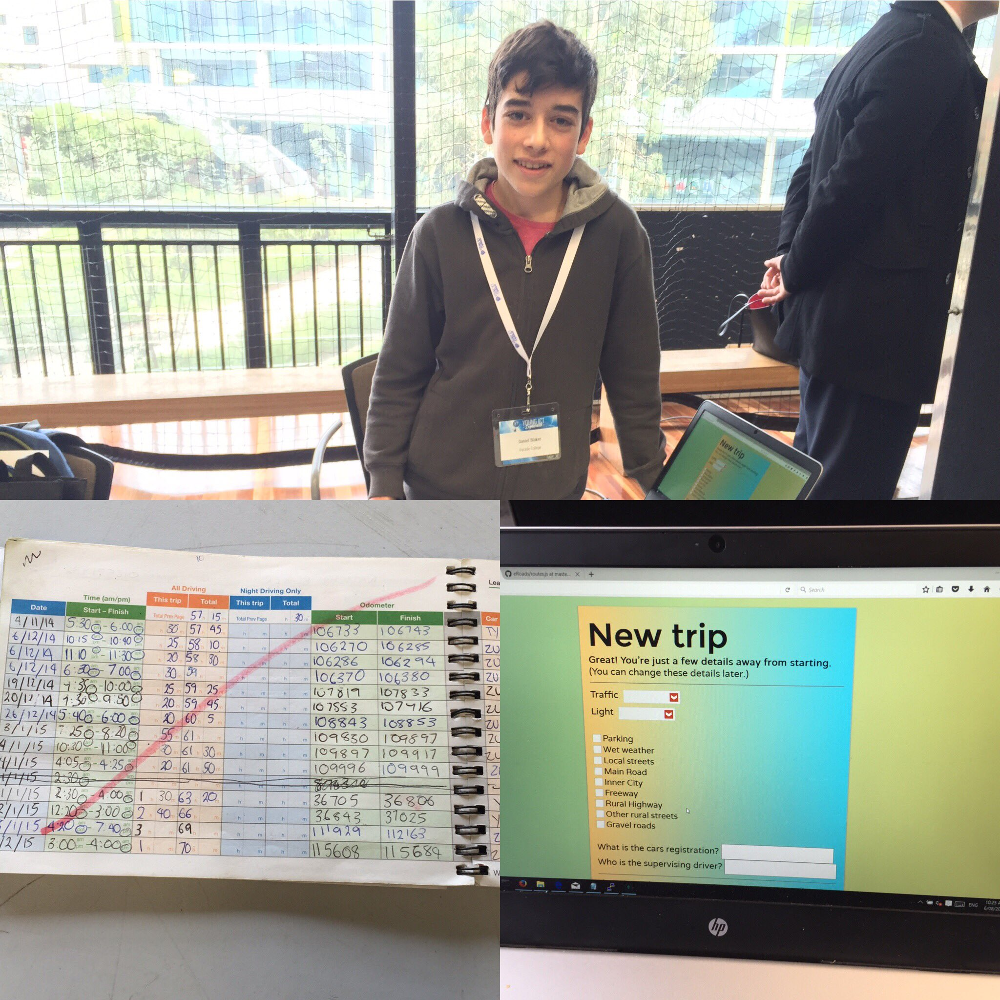

# eRoads
A website I developed in 2016 that offers an alternative to the learners log book. MEAN (Mongo DB, Express, Angular, Node) based. Developed as an entry into the Young ICT Explorers competition, which it received third prize in. Some of my earliest exposure to building a large scale MVC application.

Not maintained past the initial competition entry. A few years later, VicRoads created a mobile app that did just this - filling out driving logs on paper was indeed terrible!

